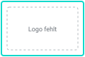

<p align="center">

</p>

<h1 align="center">Payment Logos</h1>

<p align="center">Zahlungslogos im wallee-Rahmen für Terminal, Checkout, Portal und Doku.</p>

<p align="center">


</p>

### Kartenmarken (PayFac und Acquiring)

<p>


</p>

### Wallets

<p>





</p>

### Schweiz: ep2, TWINT, PostFinance

<p>


</p>

### Online und international

<p>


</p>

### Rechnung, Ratenkauf und Bonität

<p>


</p>

### wallee-Partner

<p>


</p>

### Generische Symbole

<p>


</p>

### Legacy

<p>


</p>

<sub>Name und ID erscheinen beim Überfahren einer Kachel. Gestrichelte Kacheln: Logo fehlt noch.</sub>

## Verwenden

```html

```

Kacheln unter `dist/tiles/svg/<id>.svg`, IDs sind stabil. Jede Kachel: 120 × 80, 1 px Weiss, 2 px `#11D9CC`, Logo des Markeninhabers unverändert auf seiner eigenen Hintergrundfarbe. Neue Logos: Original nach `assets/source/`, Eintrag in `registry/`, dann `npm run build:tiles && npm run build:readme`. Regeln in [AGENTS.md](AGENTS.md).

## Hinweise

- **Alipay+** ist beim Händler Pflicht; Alipay einzeln nur mit Alipay+-Hinweis ([Richtlinien](https://docs.alipayplus.com/alipayplus/alipayplus/brand_guidelines_acq/brand_in_store_acq)).
- **Visa Electron** seit 13.04.2024 eingestellt: mit `visa` darstellen, als Legacy kennzeichnen.
- **giropay** Ende 2024 eingestellt, nur für bestehende Integrationen.
- **PostFinance** seit April 2026 im neuen Markenauftritt; in Onlineshops nur für Kunden in der Schweiz zeigen.

<details>
<summary><b>Alle Marken: ID, Gruppe, Herkunft</b></summary>

| Marke | ID | Gruppe | Herkunft |
|---|---|---|---|
| Visa | `visa` | Kartenmarken | Katalog |
| Mastercard | `mastercard` | Kartenmarken | Katalog |
| American Express | `american-express` | Kartenmarken | Katalog |
| Diners Club | `diners-club` | Kartenmarken | Katalog |
| Discover | `discover` | Kartenmarken | Katalog |
| JCB | `jcb` | Kartenmarken | Katalog |
| UnionPay | `unionpay` | Kartenmarken | Katalog |
| V PAY | `v-pay` | Kartenmarken | Katalog |
| Cartes Bancaires | `cartes-bancaires` | Kartenmarken | Katalog |
| Dankort | `dankort` | Kartenmarken | Katalog |
| Elo | `elo` | Kartenmarken | Katalog |
| Hipercard | `hipercard` | Kartenmarken | Katalog |
| UATP | `uatp` | Kartenmarken | Katalog |
| Apple Pay | `apple-pay` | Wallets | Katalog |
| Google Pay | `google-pay` | Wallets | Katalog |
| Samsung Pay | `samsung-pay` | Wallets | Katalog |
| Samsung Wallet | `samsung-wallet` | Wallets | fehlt |
| Garmin Pay | `garmin-pay` | Wallets | fehlt |
| SwatchPAY! | `swatchpay` | Wallets | Übergang |
| Xiaomi Pay | `xiaomi-pay` | Wallets | fehlt |
| Zepp Pay | `zepp-pay` | Wallets | fehlt |
| ep2 | `ep2` | Schweiz | Original |
| TWINT | `twint` | Schweiz | Website Markeninhaber |
| PostFinance Card | `postfinance-card` | Schweiz | Original |
| PostFinance Pay | `postfinance-pay` | Schweiz | Original |
| PostFinance | `postfinance` | Schweiz | fehlt |
| PostFinance e-finance | `postfinance-efinance` | Schweiz | fehlt |
| Reka | `reka` | Schweiz | Katalog |
| Lunch-Check | `lunch-check` | Schweiz | Katalog |
| boncard | `boncard` | Schweiz | Katalog |
| Bonus Card | `bonus-card` | Schweiz | Katalog |
| Migros Gift Card | `migros-giftcard` | Schweiz | Katalog |
| MediaMarkt | `mediamarkt` | Schweiz | Katalog |
| SwissPass | `swisspass` | Schweiz | Katalog |
| Half Fare Plus | `half-fare-plus` | Schweiz | Katalog |
| Swisscom Pay | `swisscom-pay` | Schweiz | Katalog |
| Click to Pay | `click-to-pay` | Online | Website Markeninhaber |
| PayPal | `paypal` | Online | Katalog |
| Alipay+ | `alipay-plus` | Online | Katalog |
| Alipay | `alipay` | Online | Katalog |
| WeChat Pay | `wechat-pay` | Online | Website Markeninhaber |
| Amazon Pay | `amazon-pay` | Online | Katalog |
| Wero | `wero` | Online | Original |
| iDEAL \| Wero | `ideal-wero` | Online | Katalog |
| iDEAL | `ideal` | Online | Katalog |
| Bancontact | `bancontact` | Online | Katalog |
| BLIK | `blik` | Online | Katalog |
| EPS | `eps` | Online | Katalog |
| MobilePay | `mobilepay` | Online | Katalog |
| Vipps | `vipps` | Online | Katalog |
| Swish | `swish` | Online | Katalog |
| Przelewy24 | `przelewy24` | Online | Katalog |
| SEPA | `sepa` | Online | Katalog |
| Skrill | `skrill` | Online | Katalog |
| Paysafecard | `paysafecard` | Online | Katalog |
| PointsPay | `pointspay` | Online | Katalog |
| DIMOCO | `dimoco` | Online | Katalog |
| Paycard | `paycard` | Online | Katalog |
| Butterfly Card | `butterfly-card` | Online | Katalog |
| Klarna | `klarna` | Rechnung | Katalog |
| POWERPAY | `powerpay` | Rechnung | Katalog |
| CembraPay | `cembrapay` | Rechnung | Katalog |
| Availabill | `availabill` | Rechnung | Katalog |
| CRIF | `crif` | Rechnung | Katalog |
| eBill | `ebill` | Rechnung | Katalog |
| Voltox Smile &amp; Pay | `voltox-smile-pay` | Partner | von wallee geliefert |
| Voltox Age Verification | `voltox-age-verification` | Partner | von wallee geliefert |
| Generic Card | `card-generic` | Generisch | Katalog |
| Generic Card Alt | `card-generic-alt` | Generisch | Katalog |
| Generic Card Gold | `card-generic-gold` | Generisch | Katalog |
| Generic Gift Card | `gift-card-generic` | Generisch | Katalog |
| Generic Gift Card Alt | `gift-card-generic-alt` | Generisch | Katalog |
| Generic Gift Card Gold | `gift-card-generic-gold` | Generisch | Katalog |
| Invoice | `invoice` | Generisch | Katalog |
| Maestro | `maestro` | Legacy | Katalog |
| giropay | `giropay` | Legacy | Katalog |

*Original* = Paket des Markeninhabers · *Website Markeninhaber* · *Übergang* = ohne Freigabe · *von wallee geliefert* · *Katalog* = Datatrans-Katalog, Ersatz ausstehend · *fehlt*

</details>

<details>
<summary><b>Offene Punkte (65)</b></summary>

| Marke | Herkunft | Nächster Schritt |
|---|---|---|
| Click to Pay | Website Markeninhaber | Icon von emvco.com; lizenzierte Datei über EMVCo-Lizenzvertrag |
| Garmin Pay | fehlt | Assets über «Request Assets» bei Garmin anfragen (Vertraulichkeitsbedingungen) |
| PostFinance | fehlt | Paket liegt vor (EPS); Kachel noch nicht angelegt |
| PostFinance e-finance | fehlt | Altes Logo zurückgezogen; Produktstatus prüfen |
| Samsung Wallet | fehlt | Offizielles Toolkit von Samsung herunterladen (ca. 38 MB) |
| SwatchPAY! | Übergang | Webbild von swatch.com; freigegebenes Original bei Swatch anfragen |
| TWINT | Website Markeninhaber | Logo von twint.ch; Merchant-Logo im TWINT Brand Portal (Login) beziehen |
| Voltox Age Verification | von wallee geliefert | Firmenlogo als PNG; Vektor und Produktlogo bei VOLTOX anfragen |
| Voltox Smile &amp; Pay | von wallee geliefert | Firmenlogo als PNG; Vektor und Produktlogo bei VOLTOX anfragen |
| WeChat Pay | Website Markeninhaber | Logo der WeChat Pay Open Platform; Richtlinien 2017 prüfen |
| Xiaomi Pay | fehlt | Keine offizielle Quelle gefunden |
| Zepp Pay | fehlt | Keine offizielle Quelle gefunden |

**Noch aus dem Datatrans-Katalog:** Alipay, Alipay+, Amazon Pay, American Express, Apple Pay, Availabill, Bancontact, BLIK, boncard, Bonus Card, Butterfly Card, Cartes Bancaires, CembraPay, CRIF, Dankort, DIMOCO, Diners Club, Discover, eBill, Elo, EPS, Generic Card, Generic Card Alt, Generic Card Gold, Generic Gift Card, Generic Gift Card Alt, Generic Gift Card Gold, giropay, Google Pay, Half Fare Plus, Hipercard, iDEAL, iDEAL | Wero, Invoice, JCB, Klarna, Lunch-Check, Maestro, Mastercard, MediaMarkt, Migros Gift Card, MobilePay, Paycard, PayPal, Paysafecard, PointsPay, POWERPAY, Przelewy24, Reka, Samsung Pay, SEPA, Skrill, Swish, Swisscom Pay, SwissPass, UATP, UnionPay, V PAY, Vipps, Visa.

Details je Quelle: [`registry/official-sources.json`](registry/official-sources.json)

</details>

<sub>Generiert von `scripts/build-readme.mjs` aus `registry/`. Nicht von Hand ändern.</sub>
