# Payment Logos

Zahlungslogos als einheitliche Kacheln für Terminal, Checkout und Portal.

### Kartenmarken (PayFac und Acquiring)

<p>

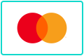


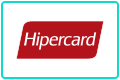

</p>

### Wallets

<p>
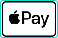


</p>

### Schweiz: ep2, TWINT, PostFinance

<p>


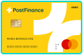


</p>

### Online und international

<p>


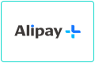
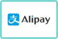


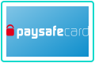


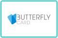
</p>

### Rechnung, Ratenkauf und Bonität

<p>

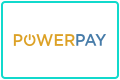


</p>

### wallee-Partner

<p>


</p>

### Generische Symbole

<p>
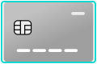


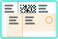
</p>

### Legacy

<p>
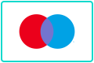

</p>

## Verwenden

```html

```

<details>
<summary>Alle IDs</summary>

| Marke | ID | Gruppe |
|---|---|---|
| Visa | `visa` | Kartenmarken |
| Mastercard | `mastercard` | Kartenmarken |
| American Express | `american-express` | Kartenmarken |
| Diners Club | `diners-club` | Kartenmarken |
| Discover | `discover` | Kartenmarken |
| JCB | `jcb` | Kartenmarken |
| UnionPay | `unionpay` | Kartenmarken |
| V PAY | `v-pay` | Kartenmarken |
| Cartes Bancaires | `cartes-bancaires` | Kartenmarken |
| Dankort | `dankort` | Kartenmarken |
| Elo | `elo` | Kartenmarken |
| Hipercard | `hipercard` | Kartenmarken |
| UATP | `uatp` | Kartenmarken |
| Apple Pay | `apple-pay` | Wallets |
| Google Pay | `google-pay` | Wallets |
| Samsung Pay | `samsung-pay` | Wallets |
| Samsung Wallet | `samsung-wallet` | Wallets |
| Garmin Pay | `garmin-pay` | Wallets |
| SwatchPAY! | `swatchpay` | Wallets |
| Xiaomi Pay | `xiaomi-pay` | Wallets |
| Zepp Pay | `zepp-pay` | Wallets |
| ep2 | `ep2` | Schweiz |
| TWINT | `twint` | Schweiz |
| PostFinance Card | `postfinance-card` | Schweiz |
| PostFinance Pay | `postfinance-pay` | Schweiz |
| PostFinance | `postfinance` | Schweiz |
| PostFinance e-finance | `postfinance-efinance` | Schweiz |
| Reka | `reka` | Schweiz |
| Lunch-Check | `lunch-check` | Schweiz |
| boncard | `boncard` | Schweiz |
| Bonus Card | `bonus-card` | Schweiz |
| Migros Gift Card | `migros-giftcard` | Schweiz |
| MediaMarkt | `mediamarkt` | Schweiz |
| SwissPass | `swisspass` | Schweiz |
| Half Fare Plus | `half-fare-plus` | Schweiz |
| Swisscom Pay | `swisscom-pay` | Schweiz |
| Click to Pay | `click-to-pay` | Online |
| PayPal | `paypal` | Online |
| Alipay+ | `alipay-plus` | Online |
| Alipay | `alipay` | Online |
| WeChat Pay | `wechat-pay` | Online |
| Amazon Pay | `amazon-pay` | Online |
| Wero | `wero` | Online |
| iDEAL \| Wero | `ideal-wero` | Online |
| iDEAL | `ideal` | Online |
| Bancontact | `bancontact` | Online |
| BLIK | `blik` | Online |
| EPS | `eps` | Online |
| MobilePay | `mobilepay` | Online |
| Vipps | `vipps` | Online |
| Swish | `swish` | Online |
| Przelewy24 | `przelewy24` | Online |
| SEPA | `sepa` | Online |
| Skrill | `skrill` | Online |
| Paysafecard | `paysafecard` | Online |
| PointsPay | `pointspay` | Online |
| DIMOCO | `dimoco` | Online |
| Paycard | `paycard` | Online |
| Butterfly Card | `butterfly-card` | Online |
| Klarna | `klarna` | Rechnung |
| POWERPAY | `powerpay` | Rechnung |
| CembraPay | `cembrapay` | Rechnung |
| Availabill | `availabill` | Rechnung |
| CRIF | `crif` | Rechnung |
| eBill | `ebill` | Rechnung |
| Voltox Smile &amp; Pay | `voltox-smile-pay` | Partner |
| Voltox Age Verification | `voltox-age-verification` | Partner |
| Generic Card | `card-generic` | Generisch |
| Generic Card Alt | `card-generic-alt` | Generisch |
| Generic Card Gold | `card-generic-gold` | Generisch |
| Generic Gift Card | `gift-card-generic` | Generisch |
| Generic Gift Card Alt | `gift-card-generic-alt` | Generisch |
| Generic Gift Card Gold | `gift-card-generic-gold` | Generisch |
| Invoice | `invoice` | Generisch |
| Maestro | `maestro` | Legacy |
| giropay | `giropay` | Legacy |

</details>

<br>
<p align="right"></p>
