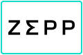
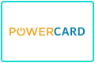
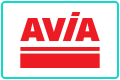
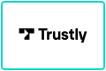
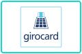
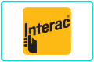

# Payment Logos

Zahlungslogos als einheitliche Kacheln für Terminal, Checkout und Portal.

### Kartenmarken (PayFac und Acquiring)

<p>
<picture><source media="(prefers-color-scheme: dark)" srcset="dist/tiles/svg-dark/mastercard.svg"></picture>
<picture><source media="(prefers-color-scheme: dark)" srcset="dist/tiles/svg-dark/visa.svg"></picture>
<picture><source media="(prefers-color-scheme: dark)" srcset="dist/tiles/svg-dark/american-express.svg"></picture>
<picture><source media="(prefers-color-scheme: dark)" srcset="dist/tiles/svg-dark/diners-club.svg"></picture>
<picture><source media="(prefers-color-scheme: dark)" srcset="dist/tiles/svg-dark/discover.svg"></picture>
<picture><source media="(prefers-color-scheme: dark)" srcset="dist/tiles/svg-dark/jcb.svg"></picture>
<picture><source media="(prefers-color-scheme: dark)" srcset="dist/tiles/svg-dark/unionpay.svg"></picture>
<picture><source media="(prefers-color-scheme: dark)" srcset="dist/tiles/svg-dark/v-pay.svg"></picture>
<picture><source media="(prefers-color-scheme: dark)" srcset="dist/tiles/svg-dark/cartes-bancaires.svg"></picture>
<picture><source media="(prefers-color-scheme: dark)" srcset="dist/tiles/svg-dark/dankort.svg"></picture>
<picture><source media="(prefers-color-scheme: dark)" srcset="dist/tiles/svg-dark/elo.svg"></picture>
<picture><source media="(prefers-color-scheme: dark)" srcset="dist/tiles/svg-dark/hipercard.svg"></picture>
<picture><source media="(prefers-color-scheme: dark)" srcset="dist/tiles/svg-dark/uatp.svg"></picture>
<picture><source media="(prefers-color-scheme: dark)" srcset="dist/tiles/svg-dark/rupay.svg"></picture>
</p>

### Wallets

<p>
<picture><source media="(prefers-color-scheme: dark)" srcset="dist/tiles/svg-dark/apple-pay.svg"></picture>
<picture><source media="(prefers-color-scheme: dark)" srcset="dist/tiles/svg-dark/google-pay.svg"></picture>
<picture><source media="(prefers-color-scheme: dark)" srcset="dist/tiles/svg-dark/samsung-pay.svg"></picture>
<picture><source media="(prefers-color-scheme: dark)" srcset="dist/tiles/svg-dark/samsung-wallet.svg"></picture>
<picture><source media="(prefers-color-scheme: dark)" srcset="dist/tiles/svg-dark/garmin-pay.svg"></picture>
<picture><source media="(prefers-color-scheme: dark)" srcset="dist/tiles/svg-dark/swatchpay.svg"></picture>
<picture><source media="(prefers-color-scheme: dark)" srcset="dist/tiles/svg-dark/xiaomi-pay.svg"></picture>
<picture><source media="(prefers-color-scheme: dark)" srcset="dist/tiles/svg-dark/zepp-pay.svg"></picture>
</p>

### Schweiz: ep2, TWINT, PostFinance

<p>
<picture><source media="(prefers-color-scheme: dark)" srcset="dist/tiles/svg-dark/ep2.svg"></picture>
<picture><source media="(prefers-color-scheme: dark)" srcset="dist/tiles/svg-dark/twint.svg"></picture>
<picture><source media="(prefers-color-scheme: dark)" srcset="dist/tiles/svg-dark/postfinance-card.svg"></picture>
<picture><source media="(prefers-color-scheme: dark)" srcset="dist/tiles/svg-dark/postfinance-pay.svg"></picture>
<picture><source media="(prefers-color-scheme: dark)" srcset="dist/tiles/svg-dark/postfinance.svg"></picture>
<picture><source media="(prefers-color-scheme: dark)" srcset="dist/tiles/svg-dark/reka.svg"></picture>
<picture><source media="(prefers-color-scheme: dark)" srcset="dist/tiles/svg-dark/lunch-check.svg"></picture>
<picture><source media="(prefers-color-scheme: dark)" srcset="dist/tiles/svg-dark/boncard.svg"></picture>
<picture><source media="(prefers-color-scheme: dark)" srcset="dist/tiles/svg-dark/bonus-card.svg"></picture>
<picture><source media="(prefers-color-scheme: dark)" srcset="dist/tiles/svg-dark/migros-giftcard.svg"></picture>
<picture><source media="(prefers-color-scheme: dark)" srcset="dist/tiles/svg-dark/mediamarkt.svg"></picture>
<picture><source media="(prefers-color-scheme: dark)" srcset="dist/tiles/svg-dark/swisspass.svg"></picture>
<picture><source media="(prefers-color-scheme: dark)" srcset="dist/tiles/svg-dark/half-fare-plus.svg"></picture>
<picture><source media="(prefers-color-scheme: dark)" srcset="dist/tiles/svg-dark/swisscom-pay.svg"></picture>
<picture><source media="(prefers-color-scheme: dark)" srcset="dist/tiles/svg-dark/chw.svg"></picture>
<picture><source media="(prefers-color-scheme: dark)" srcset="dist/tiles/svg-dark/buecherbon.svg"></picture>
<picture><source media="(prefers-color-scheme: dark)" srcset="dist/tiles/svg-dark/powercard.svg"></picture>
<picture><source media="(prefers-color-scheme: dark)" srcset="dist/tiles/svg-dark/avia.svg"></picture>
<picture><source media="(prefers-color-scheme: dark)" srcset="dist/tiles/svg-dark/swiss-pay.svg"></picture>
<picture><source media="(prefers-color-scheme: dark)" srcset="dist/tiles/svg-dark/innocard.svg"></picture>
</p>

### Online und international

<p>
<picture><source media="(prefers-color-scheme: dark)" srcset="dist/tiles/svg-dark/click-to-pay.svg"></picture>
<picture><source media="(prefers-color-scheme: dark)" srcset="dist/tiles/svg-dark/paypal.svg"></picture>
<picture><source media="(prefers-color-scheme: dark)" srcset="dist/tiles/svg-dark/alipay-plus.svg"></picture>
<picture><source media="(prefers-color-scheme: dark)" srcset="dist/tiles/svg-dark/alipay.svg"></picture>
<picture><source media="(prefers-color-scheme: dark)" srcset="dist/tiles/svg-dark/wechat-pay.svg"></picture>
<picture><source media="(prefers-color-scheme: dark)" srcset="dist/tiles/svg-dark/amazon-pay.svg"></picture>
<picture><source media="(prefers-color-scheme: dark)" srcset="dist/tiles/svg-dark/wero.svg"></picture>
<picture><source media="(prefers-color-scheme: dark)" srcset="dist/tiles/svg-dark/ideal-wero.svg"></picture>
<picture><source media="(prefers-color-scheme: dark)" srcset="dist/tiles/svg-dark/ideal.svg"></picture>
<picture><source media="(prefers-color-scheme: dark)" srcset="dist/tiles/svg-dark/bancontact.svg"></picture>
<picture><source media="(prefers-color-scheme: dark)" srcset="dist/tiles/svg-dark/blik.svg"></picture>
<picture><source media="(prefers-color-scheme: dark)" srcset="dist/tiles/svg-dark/eps.svg"></picture>
<picture><source media="(prefers-color-scheme: dark)" srcset="dist/tiles/svg-dark/mobilepay.svg"></picture>
<picture><source media="(prefers-color-scheme: dark)" srcset="dist/tiles/svg-dark/vipps.svg"></picture>
<picture><source media="(prefers-color-scheme: dark)" srcset="dist/tiles/svg-dark/swish.svg"></picture>
<picture><source media="(prefers-color-scheme: dark)" srcset="dist/tiles/svg-dark/przelewy24.svg"></picture>
<picture><source media="(prefers-color-scheme: dark)" srcset="dist/tiles/svg-dark/sepa.svg"></picture>
<picture><source media="(prefers-color-scheme: dark)" srcset="dist/tiles/svg-dark/skrill.svg"></picture>
<picture><source media="(prefers-color-scheme: dark)" srcset="dist/tiles/svg-dark/paysafecard.svg"></picture>
<picture><source media="(prefers-color-scheme: dark)" srcset="dist/tiles/svg-dark/pointspay.svg"></picture>
<picture><source media="(prefers-color-scheme: dark)" srcset="dist/tiles/svg-dark/dimoco.svg"></picture>
<picture><source media="(prefers-color-scheme: dark)" srcset="dist/tiles/svg-dark/paycard.svg"></picture>
<picture><source media="(prefers-color-scheme: dark)" srcset="dist/tiles/svg-dark/butterfly-card.svg"></picture>
<picture><source media="(prefers-color-scheme: dark)" srcset="dist/tiles/svg-dark/cryptocurrency.svg"></picture>
<picture><source media="(prefers-color-scheme: dark)" srcset="dist/tiles/svg-dark/trustly.svg"></picture>
<picture><source media="(prefers-color-scheme: dark)" srcset="dist/tiles/svg-dark/multibanco.svg"></picture>
<picture><source media="(prefers-color-scheme: dark)" srcset="dist/tiles/svg-dark/girocard.svg"></picture>
<picture><source media="(prefers-color-scheme: dark)" srcset="dist/tiles/svg-dark/interac.svg"></picture>
<picture><source media="(prefers-color-scheme: dark)" srcset="dist/tiles/svg-dark/oxxo.svg"></picture>
<picture><source media="(prefers-color-scheme: dark)" srcset="dist/tiles/svg-dark/poli.svg"></picture>
<picture><source media="(prefers-color-scheme: dark)" srcset="dist/tiles/svg-dark/tenpay.svg"></picture>
<picture><source media="(prefers-color-scheme: dark)" srcset="dist/tiles/svg-dark/bankaxess.svg"></picture>
<picture><source media="(prefers-color-scheme: dark)" srcset="dist/tiles/svg-dark/paybox.svg"></picture>
</p>

### Rechnung, Ratenkauf und Bonität

<p>
<picture><source media="(prefers-color-scheme: dark)" srcset="dist/tiles/svg-dark/klarna.svg"></picture>
<picture><source media="(prefers-color-scheme: dark)" srcset="dist/tiles/svg-dark/powerpay.svg"></picture>
<picture><source media="(prefers-color-scheme: dark)" srcset="dist/tiles/svg-dark/cembrapay.svg"></picture>
<picture><source media="(prefers-color-scheme: dark)" srcset="dist/tiles/svg-dark/availabill.svg"></picture>
<picture><source media="(prefers-color-scheme: dark)" srcset="dist/tiles/svg-dark/crif.svg"></picture>
<picture><source media="(prefers-color-scheme: dark)" srcset="dist/tiles/svg-dark/ebill.svg"></picture>
</p>

### wallee-Partner

<p>
<picture><source media="(prefers-color-scheme: dark)" srcset="dist/tiles/svg-dark/voltox-smile-pay.svg"></picture>
<picture><source media="(prefers-color-scheme: dark)" srcset="dist/tiles/svg-dark/voltox-age-verification.svg"></picture>
</p>

### Generische Symbole

<p>
<picture><source media="(prefers-color-scheme: dark)" srcset="dist/tiles/svg-dark/card-generic.svg"></picture>
<picture><source media="(prefers-color-scheme: dark)" srcset="dist/tiles/svg-dark/card-generic-alt.svg"></picture>
<picture><source media="(prefers-color-scheme: dark)" srcset="dist/tiles/svg-dark/card-generic-gold.svg"></picture>
<picture><source media="(prefers-color-scheme: dark)" srcset="dist/tiles/svg-dark/gift-card-generic.svg"></picture>
<picture><source media="(prefers-color-scheme: dark)" srcset="dist/tiles/svg-dark/gift-card-generic-alt.svg"></picture>
<picture><source media="(prefers-color-scheme: dark)" srcset="dist/tiles/svg-dark/gift-card-generic-gold.svg"></picture>
<picture><source media="(prefers-color-scheme: dark)" srcset="dist/tiles/svg-dark/invoice.svg"></picture>
</p>

### Legacy

<p>
<picture><source media="(prefers-color-scheme: dark)" srcset="dist/tiles/svg-dark/maestro.svg"></picture>
<picture><source media="(prefers-color-scheme: dark)" srcset="dist/tiles/svg-dark/giropay.svg"></picture>
<picture><source media="(prefers-color-scheme: dark)" srcset="dist/tiles/svg-dark/masterpass.svg"></picture>
<picture><source media="(prefers-color-scheme: dark)" srcset="dist/tiles/svg-dark/sofort.svg"></picture>
<picture><source media="(prefers-color-scheme: dark)" srcset="dist/tiles/svg-dark/paydirekt.svg"></picture>
<picture><source media="(prefers-color-scheme: dark)" srcset="dist/tiles/svg-dark/qiwi.svg"></picture>
<picture><source media="(prefers-color-scheme: dark)" srcset="dist/tiles/svg-dark/cashu.svg"></picture>
<picture><source media="(prefers-color-scheme: dark)" srcset="dist/tiles/svg-dark/daopay.svg"></picture>
<picture><source media="(prefers-color-scheme: dark)" srcset="dist/tiles/svg-dark/payconiq.svg"></picture>
<picture><source media="(prefers-color-scheme: dark)" srcset="dist/tiles/svg-dark/paylib.svg"></picture>
</p>

## Verwenden

Hell in `dist/tiles/svg/`, dunkel in `dist/tiles/svg-dark/`, gleiche Dateinamen. Diese Seite zeigt automatisch die Variante zu deinem GitHub-Farbschema.

```html
<picture>
  <source media="(prefers-color-scheme: dark)" srcset="https://raw.githubusercontent.com/forseti1982/payment-logos-archive/master/dist/tiles/svg-dark/twint.svg">
  
</picture>
```

<details>
<summary>Alle IDs und AIDs (Application Identifier)</summary>

Quellen und Hinweise zu den AIDs: [docs/AID-QUELLEN.md](docs/AID-QUELLEN.md).

| Marke | ID | Gruppe | AID (Application Identifier, ep2, aktiv) |
|---|---|---|---|
| Mastercard | `mastercard` | Kartenmarken | `A0 00 00 01 57 00 20`<br>`A0 00 00 01 57 44 9B` |
| Visa | `visa` | Kartenmarken | `A0 00 00 01 57 00 30`<br>`A0 00 00 01 57 00 31` |
| American Express | `american-express` | Kartenmarken | `A0 00 00 01 57 00 10`<br>`A0 00 00 01 57 44 58` |
| Diners Club | `diners-club` | Kartenmarken | `A0 00 00 01 57 44 43` |
| Discover | `discover` | Kartenmarken |  |
| JCB | `jcb` | Kartenmarken | `A0 00 00 01 57 00 40` |
| UnionPay | `unionpay` | Kartenmarken | `A0 00 00 01 57 44 60` |
| V PAY | `v-pay` | Kartenmarken | `A0 00 00 01 57 44 52`<br>`A0 00 00 01 57 44 7C` |
| Cartes Bancaires | `cartes-bancaires` | Kartenmarken |  |
| Dankort | `dankort` | Kartenmarken |  |
| Elo | `elo` | Kartenmarken |  |
| Hipercard | `hipercard` | Kartenmarken |  |
| UATP | `uatp` | Kartenmarken |  |
| RuPay | `rupay` | Kartenmarken |  |
| Apple Pay | `apple-pay` | Wallets |  |
| Google Pay | `google-pay` | Wallets |  |
| Samsung Pay | `samsung-pay` | Wallets |  |
| Samsung Wallet | `samsung-wallet` | Wallets |  |
| Garmin Pay | `garmin-pay` | Wallets |  |
| SwatchPAY! | `swatchpay` | Wallets |  |
| Xiaomi Pay | `xiaomi-pay` | Wallets |  |
| Zepp Pay | `zepp-pay` | Wallets |  |
| ep2 | `ep2` | Schweiz |  |
| TWINT | `twint` | Schweiz | `A0 00 00 01 57 44 9E` |
| PostFinance Card | `postfinance-card` | Schweiz | `A0 00 00 01 57 00 51` |
| PostFinance Pay | `postfinance-pay` | Schweiz | `A0 00 00 01 57 44 FB` |
| PostFinance | `postfinance` | Schweiz |  |
| Reka | `reka` | Schweiz | `A0 00 00 01 57 44 8C`<br>`A0 00 00 01 57 44 95`<br>`A0 00 00 01 57 44 96`<br>`A0 00 00 01 57 44 97` |
| Lunch-Check | `lunch-check` | Schweiz | `A0 00 00 01 57 44 7D`<br>`D7 56 00 01 15 00 01` |
| boncard | `boncard` | Schweiz | `A0 00 00 01 57 44 55`<br>`A0 00 00 01 57 44 5B` |
| Bonus Card | `bonus-card` | Schweiz | `A0 00 00 01 57 01 0B` |
| Migros Gift Card | `migros-giftcard` | Schweiz |  |
| MediaMarkt | `mediamarkt` | Schweiz | `A0 00 00 01 57 01 09` |
| SwissPass | `swisspass` | Schweiz |  |
| Half Fare Plus | `half-fare-plus` | Schweiz |  |
| Swisscom Pay | `swisscom-pay` | Schweiz |  |
| CHW (WIR) | `chw` | Schweiz | `A0 00 00 01 57 01 0C`<br>`A0 00 00 01 62 00 03 10`<br>`A0 00 00 01 62 00 03 11` |
| Bücherbon | `buecherbon` | Schweiz |  |
| POWERCARD | `powercard` | Schweiz | `A0 00 00 01 57 01 0D`<br>`A0 00 00 01 57 44 76`<br>`A0 00 00 01 57 44 78`<br>`A0 00 00 01 57 44 79` |
| AVIA | `avia` | Schweiz | `A0 00 00 01 57 44 C3` |
| EKZ | `ekz` | Schweiz | `A0 00 00 01 57 44 7F` |
| Swiss Pay | `swiss-pay` | Schweiz | `A0 00 00 01 57 44 BD`<br>`A0 00 00 08 01 00 01` |
| Innocard | `innocard` | Schweiz | `A0 00 00 01 57 44 49`<br>`A0 00 00 01 57 44 5A`<br>`A0 00 00 01 57 44 63`<br>`A0 00 00 01 57 44 6E`<br>`A0 00 00 01 57 44 6F`<br>`A0 00 00 01 57 44 75`<br>`A0 00 00 01 57 44 7A`<br>`A0 00 00 01 57 44 87`<br>`A0 00 00 01 57 44 88`<br>`A0 00 00 01 57 44 89`<br>`A0 00 00 01 57 44 8A` |
| Click to Pay | `click-to-pay` | Online |  |
| PayPal | `paypal` | Online | `A0 00 00 01 57 44 EE` |
| Alipay+ | `alipay-plus` | Online |  |
| Alipay | `alipay` | Online | `A0 00 00 01 57 44 A0` |
| WeChat Pay | `wechat-pay` | Online | `A0 00 00 01 57 44 C6` |
| Amazon Pay | `amazon-pay` | Online |  |
| Wero | `wero` | Online |  |
| iDEAL \| Wero | `ideal-wero` | Online |  |
| iDEAL | `ideal` | Online |  |
| Bancontact | `bancontact` | Online |  |
| BLIK | `blik` | Online | `A0 00 00 01 57 44 F9` |
| EPS | `eps` | Online |  |
| MobilePay | `mobilepay` | Online |  |
| Vipps | `vipps` | Online |  |
| Swish | `swish` | Online |  |
| Przelewy24 | `przelewy24` | Online |  |
| SEPA | `sepa` | Online |  |
| Skrill | `skrill` | Online |  |
| Paysafecard | `paysafecard` | Online |  |
| PointsPay | `pointspay` | Online |  |
| DIMOCO | `dimoco` | Online |  |
| Paycard | `paycard` | Online | `A0 00 00 01 57 44 8D`<br>`A0 00 00 01 57 44 8E`<br>`A0 00 00 01 57 44 8F` |
| Butterfly Card | `butterfly-card` | Online | `A0 00 00 01 57 01 12` |
| Kryptowährung | `cryptocurrency` | Online |  |
| Trustly | `trustly` | Online |  |
| Multibanco | `multibanco` | Online |  |
| girocard | `girocard` | Online |  |
| Pay by Bank | `pay-by-bank` | Online |  |
| Interac Online | `interac` | Online |  |
| Boleto Bancário | `boleto` | Online |  |
| OXXO | `oxxo` | Online |  |
| POLi | `poli` | Online |  |
| Tenpay | `tenpay` | Online |  |
| BankAxess | `bankaxess` | Online |  |
| paybox | `paybox` | Online |  |
| Klarna | `klarna` | Rechnung |  |
| POWERPAY | `powerpay` | Rechnung |  |
| CembraPay | `cembrapay` | Rechnung |  |
| Availabill | `availabill` | Rechnung |  |
| CRIF | `crif` | Rechnung |  |
| eBill | `ebill` | Rechnung |  |
| Voltox Smile &amp; Pay | `voltox-smile-pay` | Partner |  |
| Voltox Age Verification | `voltox-age-verification` | Partner |  |
| Generic Card | `card-generic` | Generisch |  |
| Generic Card Alt | `card-generic-alt` | Generisch |  |
| Generic Card Gold | `card-generic-gold` | Generisch |  |
| Generic Gift Card | `gift-card-generic` | Generisch |  |
| Generic Gift Card Alt | `gift-card-generic-alt` | Generisch |  |
| Generic Gift Card Gold | `gift-card-generic-gold` | Generisch |  |
| Invoice | `invoice` | Generisch |  |
| Maestro | `maestro` | Legacy | `A0 00 00 01 57 00 21`<br>`A0 00 00 01 57 00 22` |
| giropay | `giropay` | Legacy |  |
| PostFinance e-finance | `postfinance-efinance` | Legacy |  |
| Masterpass | `masterpass` | Legacy |  |
| SOFORT | `sofort` | Legacy |  |
| paydirekt | `paydirekt` | Legacy |  |
| QIWI | `qiwi` | Legacy |  |
| CASHU | `cashu` | Legacy |  |
| DaoPay | `daopay` | Legacy |  |
| Payconiq | `payconiq` | Legacy | `A0 00 00 01 57 44 E0` |
| Paylib | `paylib` | Legacy |  |

</details>

<br>
<p align="right"></p>
