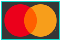
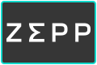
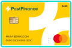
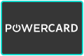
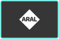
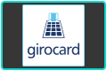
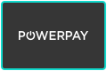
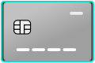

# Payment Logos

Zahlungslogos als einheitliche Kacheln für Terminal, Checkout und Portal.

## Hell

#### Kartenmarken (PayFac und Acquiring)

<p>


</p>

#### Wallets

<p>


</p>

#### Schweiz: ep2, TWINT, PostFinance

<p>


</p>

#### Tank- und Flottenkarten

<p>


</p>

#### Online und international

<p>


</p>

#### Rechnung, Ratenkauf und Bonität

<p>


</p>

#### wallee-Partner

<p>


</p>

#### Generische Symbole

<p>


</p>

#### Legacy

<p>


</p>

## Dunkel

#### Kartenmarken (PayFac und Acquiring)

<p>



</p>

#### Wallets

<p>



</p>

#### Schweiz: ep2, TWINT, PostFinance

<p>








</p>

#### Tank- und Flottenkarten

<p>





</p>

#### Online und international

<p>





</p>

#### Rechnung, Ratenkauf und Bonität

<p>




</p>

#### wallee-Partner

<p>


</p>

#### Generische Symbole

<p>



</p>

#### Legacy

<p>


</p>

## AID (Application Identifier)

Zuordnung der aktiven ep2-AIDs zu Marke und Kachel. Maschinenlesbar in `registry/brands.json` (`ep2Aids`), Quellen in [docs/AID-QUELLEN.md](docs/AID-QUELLEN.md).

| Hell | Dunkel | Marke / ID | AID | Bezeichnung |
|---|---|---|---|---|
|  |  | Mastercard<br>`mastercard` | `A0 00 00 01 57 00 20`<br>`A0 00 00 01 57 44 9B` | MasterCard Magstripe<br>Debit MasterCard CH (nur Brand ID) |
|  |  | Visa<br>`visa` | `A0 00 00 01 57 00 30`<br>`A0 00 00 01 57 00 31` | Visa Magstripe<br>Visa Electron Magstripe |
|  |  | American Express<br>`american-express` | `A0 00 00 01 57 00 10`<br>`A0 00 00 01 57 44 58` | American Express Magstripe<br>American Express |
|  |  | Diners Club<br>`diners-club` | `A0 00 00 01 57 44 43` | Diners Magstripe |
|  |  | JCB<br>`jcb` | `A0 00 00 01 57 00 40` | JCB Magstripe |
|  |  | UnionPay<br>`unionpay` | `A0 00 00 01 57 44 60` | Union Pay  (UP) |
|  |  | V PAY<br>`v-pay` | `A0 00 00 01 57 44 52`<br>`A0 00 00 01 57 44 7C` | V PAY<br>V PAY CH |
|  |  | TWINT<br>`twint` | `A0 00 00 01 57 44 9E` | TWINT |
|  |  | PostFinance Card<br>`postfinance-card` | `A0 00 00 01 57 00 51` | PostFinance Card Magstripe |
|  |  | PostFinance Pay<br>`postfinance-pay` | `A0 00 00 01 57 44 FB` | PF Pay |
|  |  | Reka<br>`reka` | `A0 00 00 01 57 44 8C`<br>`A0 00 00 01 57 44 95`<br>`A0 00 00 01 57 44 96`<br>`A0 00 00 01 57 44 97` | Reka E-Commerce<br>Reka Rail<br>Reka-Check<br>Reka-Lunch |
|  |  | Lunch-Check<br>`lunch-check` | `A0 00 00 01 57 44 7D`<br>`D7 56 00 01 15 00 01` | Lunch-Check II<br>Lunch-Check I |
|  |  | boncard<br>`boncard` | `A0 00 00 01 57 44 55`<br>`A0 00 00 01 57 44 5B` | boncard POINTS<br>boncard PAY |
|  |  | Bonus Card<br>`bonus-card` | `A0 00 00 01 57 01 0B` | Bonuscard |
|  |  | MediaMarkt<br>`mediamarkt` | `A0 00 00 01 57 01 09` | Mediamarkt Card |
|  |  | CHW (WIR)<br>`chw` | `A0 00 00 01 57 01 0C`<br>`A0 00 00 01 62 00 03 10`<br>`A0 00 00 01 62 00 03 11` | WIR Card<br>WIR Card Plus (VPAY)<br>WIR Card Plus (DMC) |
|  |  | POWERCARD<br>`powercard` | `A0 00 00 01 57 01 0D`<br>`A0 00 00 01 57 44 76`<br>`A0 00 00 01 57 44 78`<br>`A0 00 00 01 57 44 79` | PowerCard<br>PowerCard<br>PowerCard<br>PowerCard |
| Logo fehlt |  | EKZ<br>`ekz` | `A0 00 00 01 57 44 7F` | EKZ card |
|  |  | Swiss Pay<br>`swiss-pay` | `A0 00 00 01 57 44 BD`<br>`A0 00 00 08 01 00 01` | Swiss PAY II<br>Swiss PAY |
|  |  | Innocard<br>`innocard` | `A0 00 00 01 57 44 49`<br>`A0 00 00 01 57 44 5A`<br>`A0 00 00 01 57 44 63`<br>`A0 00 00 01 57 44 6E`<br>`A0 00 00 01 57 44 6F`<br>`A0 00 00 01 57 44 75`<br>`A0 00 00 01 57 44 7A`<br>`A0 00 00 01 57 44 87`<br>`A0 00 00 01 57 44 88`<br>`A0 00 00 01 57 44 89`<br>`A0 00 00 01 57 44 8A` | SwissBonusCard<br>SwissCadeau<br>SwissBonus+<br>SwissCredit<br>SwissVoucher<br>Innofriends<br>loyalty.Marketing<br>Prepaid.Innocard<br>Loyalty.Innocard<br>Bonus.Innocard<br>Gift.Innocard |
|  |  | AVIA<br>`avia` | `A0 00 00 01 57 44 C3` | AVIA |
| Logo fehlt |  | Shell (euroShell)<br>`shell` | `A0 00 00 01 57 44 6A`<br>`A0 00 00 01 57 44 6B`<br>`A0 00 00 01 57 44 6C`<br>`A0 00 00 01 57 44 9F`<br>`A0 00 00 01 57 44 D8` | euroShell CRT (Commercial Road Transport)<br>euroShell Fleet<br>euroShell Private<br>euroShell Prepaid<br>Shell-BE |
|  |  | Esso<br>`esso` | `A0 00 00 01 57 44 68`<br>`A0 00 00 01 57 44 69` | Esso CRT (Commercial Road Transport)<br>Esso Fleet |
| Logo fehlt |  | BP<br>`bp` | `A0 00 00 01 57 44 AA` | BP Routex |
|  |  | Aral<br>`aral` | `A0 00 00 01 57 44 B0` | ARAL Routex |
|  |  | OMV<br>`omv` | `A0 00 00 01 57 44 AF` | OMV Routex |
|  |  | Eni<br>`eni` | `A0 00 00 01 57 44 A8`<br>`A0 00 00 01 57 44 C2` | ENI Routex<br>ENI Plus |
| Logo fehlt |  | Routex<br>`routex` | `A0 00 00 01 57 44 B4`<br>`A0 00 00 01 57 44 B5`<br>`A0 00 00 01 57 44 D5` | Statoil Routex<br>IP Routex<br>Routex-Tex |
|  |  | JET<br>`jet` | `A0 00 00 01 57 44 DD` | Jet |
|  |  | Q8<br>`q8` | `A0 00 00 01 57 44 D2` | Q8 |
|  |  | Texaco<br>`texaco` | `A0 00 00 01 57 44 D3` | TEXACO |
|  |  | Lukoil<br>`lukoil` | `A0 00 00 01 57 44 D1` | LUKOIL |
|  |  | Agrola<br>`agrola` | `A0 00 00 01 57 44 A4`<br>`D7 56 00 01 18 01 01` | Agrola<br>AGROLA energy card |
|  |  | Migrol<br>`migrol` | `A0 00 00 01 57 44 8B` | Migrolcard |
|  |  | Tamoil<br>`tamoil` | `A0 00 00 01 57 44 A1` | Tamoil Card |
|  |  | SOCAR<br>`socar` | `A0 00 00 01 57 44 B6`<br>`A0 00 00 01 57 44 B8`<br>`A0 00 00 01 57 44 C8`<br>`A0 00 00 01 57 44 EC`<br>`A0 00 00 01 57 44 ED` | SOCAR J-C<br>SOCAR Classic<br>SOCAR AT<br>SOCAR CO-BRA Retail<br>SOCAR Retail |
| Logo fehlt |  | DKV<br>`dkv` | `A0 00 00 01 57 44 6D`<br>`A0 00 00 01 57 44 A6`<br>`A0 00 00 01 57 44 AD`<br>`A0 00 00 01 57 44 FF` | DKV Fleetcard<br>DKV<br>DKV<br>DKV Austria |
|  |  | UTA<br>`uta` | `A0 00 00 01 57 44 A5`<br>`A0 00 00 01 57 44 AC`<br>`A0 00 00 01 57 44 AE`<br>`A0 00 00 01 57 44 FE` | UTA<br>UTA select card<br>UTA Full Service Card<br>UTA Austria |
| Logo fehlt |  | Eurowag<br>`eurowag` | `A0 00 00 01 57 44 DE` | Eurowag |
| Logo fehlt |  | Novofleet<br>`novofleet` | `A0 00 00 01 57 44 AB` | Novofleet |
| Logo fehlt |  | LogPay<br>`logpay` | `A0 00 00 01 57 44 B1`<br>`A0 00 00 01 57 44 B2`<br>`A0 00 00 01 57 44 B3` | Logpay 2<br>Logpay 1<br>Logpay 3 |
| Logo fehlt |  | Transcard<br>`transcard` | `A0 00 00 01 57 44 A2` | Transcard |
| Logo fehlt |  | Oel-Pool<br>`oel-pool` | `A0 00 00 01 57 44 A3` | Oel-Pool Card |
| Logo fehlt |  | Oil!<br>`oil` | `A0 00 00 01 57 44 C7` | Oil! F+F Flottenkarte |
|  |  | HOYER<br>`hoyer` | `A0 00 00 01 57 45 00` | HoyerCard |
| Logo fehlt |  | Jubin<br>`jubin` | `A0 00 00 01 57 44 5F` | Jubin Card / Petrol |
| Logo fehlt |  | Voegtlin-Meyer<br>`voegtlin-meyer` | `A0 00 00 01 57 44 C4`<br>`A0 00 00 01 57 44 CE`<br>`A0 00 00 01 57 44 CF` | Voegtlin-Meyer<br>Voegtlin-Meyer<br>Voegtlin-Meyer |
| Logo fehlt |  | Moveri<br>`moveri` | `A0 00 00 01 57 44 BE` | Moveri |
|  |  | PayPal<br>`paypal` | `A0 00 00 01 57 44 EE` | PayPal |
|  |  | Alipay<br>`alipay` | `A0 00 00 01 57 44 A0` | Alipay |
|  |  | WeChat Pay<br>`wechat-pay` | `A0 00 00 01 57 44 C6` | WeChatPay |
|  |  | BLIK<br>`blik` | `A0 00 00 01 57 44 F9` | BLIK |
|  |  | Paycard<br>`paycard` | `A0 00 00 01 57 44 8D`<br>`A0 00 00 01 57 44 8E`<br>`A0 00 00 01 57 44 8F` | paycard App<br>paycard<br>paycard F |
|  |  | Butterfly Card<br>`butterfly-card` | `A0 00 00 01 57 01 12` | Accarda Butterfly |
|  |  | Maestro<br>`maestro` | `A0 00 00 01 57 00 21`<br>`A0 00 00 01 57 00 22` | Maestro Magstripe (International)<br>Maestro-CH |
|  |  | Payconiq<br>`payconiq` | `A0 00 00 01 57 44 E0` | Payconiq |

## Verwenden

Hell in `dist/tiles/svg/`, dunkel in `dist/tiles/svg-dark/`, gleiche Dateinamen. Mit `<picture>` wechselt die Kachel automatisch mit dem Farbschema:

```html
<picture>
  <source media="(prefers-color-scheme: dark)" srcset="https://raw.githubusercontent.com/forseti1982/payment-logos-archive/master/dist/tiles/svg-dark/twint.svg">
  
</picture>
```

<details>
<summary>Alle IDs und AIDs (Application Identifier)</summary>

Quellen und Hinweise zu den AIDs: [docs/AID-QUELLEN.md](docs/AID-QUELLEN.md).

| Marke | ID | Gruppe | AID (Application Identifier, ep2, aktiv) |
|---|---|---|---|
| Mastercard | `mastercard` | Kartenmarken | `A0 00 00 01 57 00 20`<br>`A0 00 00 01 57 44 9B` |
| Visa | `visa` | Kartenmarken | `A0 00 00 01 57 00 30`<br>`A0 00 00 01 57 00 31` |
| American Express | `american-express` | Kartenmarken | `A0 00 00 01 57 00 10`<br>`A0 00 00 01 57 44 58` |
| Diners Club | `diners-club` | Kartenmarken | `A0 00 00 01 57 44 43` |
| Discover | `discover` | Kartenmarken |  |
| JCB | `jcb` | Kartenmarken | `A0 00 00 01 57 00 40` |
| UnionPay | `unionpay` | Kartenmarken | `A0 00 00 01 57 44 60` |
| V PAY | `v-pay` | Kartenmarken | `A0 00 00 01 57 44 52`<br>`A0 00 00 01 57 44 7C` |
| Cartes Bancaires | `cartes-bancaires` | Kartenmarken |  |
| Dankort | `dankort` | Kartenmarken |  |
| Elo | `elo` | Kartenmarken |  |
| Hipercard | `hipercard` | Kartenmarken |  |
| UATP | `uatp` | Kartenmarken |  |
| RuPay | `rupay` | Kartenmarken |  |
| Apple Pay | `apple-pay` | Wallets |  |
| Google Pay | `google-pay` | Wallets |  |
| Samsung Pay | `samsung-pay` | Wallets |  |
| Samsung Wallet | `samsung-wallet` | Wallets |  |
| Garmin Pay | `garmin-pay` | Wallets |  |
| SwatchPAY! | `swatchpay` | Wallets |  |
| Xiaomi Pay | `xiaomi-pay` | Wallets |  |
| Zepp Pay | `zepp-pay` | Wallets |  |
| ep2 | `ep2` | Schweiz |  |
| TWINT | `twint` | Schweiz | `A0 00 00 01 57 44 9E` |
| PostFinance Card | `postfinance-card` | Schweiz | `A0 00 00 01 57 00 51` |
| PostFinance Pay | `postfinance-pay` | Schweiz | `A0 00 00 01 57 44 FB` |
| PostFinance | `postfinance` | Schweiz |  |
| Reka | `reka` | Schweiz | `A0 00 00 01 57 44 8C`<br>`A0 00 00 01 57 44 95`<br>`A0 00 00 01 57 44 96`<br>`A0 00 00 01 57 44 97` |
| Lunch-Check | `lunch-check` | Schweiz | `A0 00 00 01 57 44 7D`<br>`D7 56 00 01 15 00 01` |
| boncard | `boncard` | Schweiz | `A0 00 00 01 57 44 55`<br>`A0 00 00 01 57 44 5B` |
| Bonus Card | `bonus-card` | Schweiz | `A0 00 00 01 57 01 0B` |
| Migros Gift Card | `migros-giftcard` | Schweiz |  |
| MediaMarkt | `mediamarkt` | Schweiz | `A0 00 00 01 57 01 09` |
| SwissPass | `swisspass` | Schweiz |  |
| Half Fare Plus | `half-fare-plus` | Schweiz |  |
| Swisscom Pay | `swisscom-pay` | Schweiz |  |
| CHW (WIR) | `chw` | Schweiz | `A0 00 00 01 57 01 0C`<br>`A0 00 00 01 62 00 03 10`<br>`A0 00 00 01 62 00 03 11` |
| Bücherbon | `buecherbon` | Schweiz |  |
| POWERCARD | `powercard` | Schweiz | `A0 00 00 01 57 01 0D`<br>`A0 00 00 01 57 44 76`<br>`A0 00 00 01 57 44 78`<br>`A0 00 00 01 57 44 79` |
| EKZ | `ekz` | Schweiz | `A0 00 00 01 57 44 7F` |
| Swiss Pay | `swiss-pay` | Schweiz | `A0 00 00 01 57 44 BD`<br>`A0 00 00 08 01 00 01` |
| Innocard | `innocard` | Schweiz | `A0 00 00 01 57 44 49`<br>`A0 00 00 01 57 44 5A`<br>`A0 00 00 01 57 44 63`<br>`A0 00 00 01 57 44 6E`<br>`A0 00 00 01 57 44 6F`<br>`A0 00 00 01 57 44 75`<br>`A0 00 00 01 57 44 7A`<br>`A0 00 00 01 57 44 87`<br>`A0 00 00 01 57 44 88`<br>`A0 00 00 01 57 44 89`<br>`A0 00 00 01 57 44 8A` |
| AVIA | `avia` | Tank/Flotte | `A0 00 00 01 57 44 C3` |
| Shell (euroShell) | `shell` | Tank/Flotte | `A0 00 00 01 57 44 6A`<br>`A0 00 00 01 57 44 6B`<br>`A0 00 00 01 57 44 6C`<br>`A0 00 00 01 57 44 9F`<br>`A0 00 00 01 57 44 D8` |
| Esso | `esso` | Tank/Flotte | `A0 00 00 01 57 44 68`<br>`A0 00 00 01 57 44 69` |
| BP | `bp` | Tank/Flotte | `A0 00 00 01 57 44 AA` |
| Aral | `aral` | Tank/Flotte | `A0 00 00 01 57 44 B0` |
| OMV | `omv` | Tank/Flotte | `A0 00 00 01 57 44 AF` |
| Eni | `eni` | Tank/Flotte | `A0 00 00 01 57 44 A8`<br>`A0 00 00 01 57 44 C2` |
| Routex | `routex` | Tank/Flotte | `A0 00 00 01 57 44 B4`<br>`A0 00 00 01 57 44 B5`<br>`A0 00 00 01 57 44 D5` |
| JET | `jet` | Tank/Flotte | `A0 00 00 01 57 44 DD` |
| Q8 | `q8` | Tank/Flotte | `A0 00 00 01 57 44 D2` |
| Texaco | `texaco` | Tank/Flotte | `A0 00 00 01 57 44 D3` |
| Lukoil | `lukoil` | Tank/Flotte | `A0 00 00 01 57 44 D1` |
| Agrola | `agrola` | Tank/Flotte | `A0 00 00 01 57 44 A4`<br>`D7 56 00 01 18 01 01` |
| Migrol | `migrol` | Tank/Flotte | `A0 00 00 01 57 44 8B` |
| Tamoil | `tamoil` | Tank/Flotte | `A0 00 00 01 57 44 A1` |
| SOCAR | `socar` | Tank/Flotte | `A0 00 00 01 57 44 B6`<br>`A0 00 00 01 57 44 B8`<br>`A0 00 00 01 57 44 C8`<br>`A0 00 00 01 57 44 EC`<br>`A0 00 00 01 57 44 ED` |
| DKV | `dkv` | Tank/Flotte | `A0 00 00 01 57 44 6D`<br>`A0 00 00 01 57 44 A6`<br>`A0 00 00 01 57 44 AD`<br>`A0 00 00 01 57 44 FF` |
| UTA | `uta` | Tank/Flotte | `A0 00 00 01 57 44 A5`<br>`A0 00 00 01 57 44 AC`<br>`A0 00 00 01 57 44 AE`<br>`A0 00 00 01 57 44 FE` |
| Eurowag | `eurowag` | Tank/Flotte | `A0 00 00 01 57 44 DE` |
| Novofleet | `novofleet` | Tank/Flotte | `A0 00 00 01 57 44 AB` |
| LogPay | `logpay` | Tank/Flotte | `A0 00 00 01 57 44 B1`<br>`A0 00 00 01 57 44 B2`<br>`A0 00 00 01 57 44 B3` |
| Transcard | `transcard` | Tank/Flotte | `A0 00 00 01 57 44 A2` |
| Oel-Pool | `oel-pool` | Tank/Flotte | `A0 00 00 01 57 44 A3` |
| Oil! | `oil` | Tank/Flotte | `A0 00 00 01 57 44 C7` |
| HOYER | `hoyer` | Tank/Flotte | `A0 00 00 01 57 45 00` |
| Jubin | `jubin` | Tank/Flotte | `A0 00 00 01 57 44 5F` |
| Voegtlin-Meyer | `voegtlin-meyer` | Tank/Flotte | `A0 00 00 01 57 44 C4`<br>`A0 00 00 01 57 44 CE`<br>`A0 00 00 01 57 44 CF` |
| Moveri | `moveri` | Tank/Flotte | `A0 00 00 01 57 44 BE` |
| Click to Pay | `click-to-pay` | Online |  |
| PayPal | `paypal` | Online | `A0 00 00 01 57 44 EE` |
| Alipay+ | `alipay-plus` | Online |  |
| Alipay | `alipay` | Online | `A0 00 00 01 57 44 A0` |
| WeChat Pay | `wechat-pay` | Online | `A0 00 00 01 57 44 C6` |
| Amazon Pay | `amazon-pay` | Online |  |
| Wero | `wero` | Online |  |
| iDEAL \| Wero | `ideal-wero` | Online |  |
| iDEAL | `ideal` | Online |  |
| Bancontact | `bancontact` | Online |  |
| BLIK | `blik` | Online | `A0 00 00 01 57 44 F9` |
| EPS | `eps` | Online |  |
| MobilePay | `mobilepay` | Online |  |
| Vipps | `vipps` | Online |  |
| Swish | `swish` | Online |  |
| Przelewy24 | `przelewy24` | Online |  |
| SEPA | `sepa` | Online |  |
| Skrill | `skrill` | Online |  |
| Paysafecard | `paysafecard` | Online |  |
| PointsPay | `pointspay` | Online |  |
| DIMOCO | `dimoco` | Online |  |
| Paycard | `paycard` | Online | `A0 00 00 01 57 44 8D`<br>`A0 00 00 01 57 44 8E`<br>`A0 00 00 01 57 44 8F` |
| Butterfly Card | `butterfly-card` | Online | `A0 00 00 01 57 01 12` |
| Kryptowährung | `cryptocurrency` | Online |  |
| Trustly | `trustly` | Online |  |
| Multibanco | `multibanco` | Online |  |
| girocard | `girocard` | Online |  |
| Pay by Bank | `pay-by-bank` | Online |  |
| Interac Online | `interac` | Online |  |
| Boleto Bancário | `boleto` | Online |  |
| OXXO | `oxxo` | Online |  |
| POLi | `poli` | Online |  |
| Tenpay | `tenpay` | Online |  |
| BankAxess | `bankaxess` | Online |  |
| paybox | `paybox` | Online |  |
| Klarna | `klarna` | Rechnung |  |
| POWERPAY | `powerpay` | Rechnung |  |
| CembraPay | `cembrapay` | Rechnung |  |
| Availabill | `availabill` | Rechnung |  |
| CRIF | `crif` | Rechnung |  |
| eBill | `ebill` | Rechnung |  |
| Voltox Smile &amp; Pay | `voltox-smile-pay` | Partner |  |
| Voltox Age Verification | `voltox-age-verification` | Partner |  |
| Generic Card | `card-generic` | Generisch |  |
| Generic Card Alt | `card-generic-alt` | Generisch |  |
| Generic Card Gold | `card-generic-gold` | Generisch |  |
| Generic Gift Card | `gift-card-generic` | Generisch |  |
| Generic Gift Card Alt | `gift-card-generic-alt` | Generisch |  |
| Generic Gift Card Gold | `gift-card-generic-gold` | Generisch |  |
| Invoice | `invoice` | Generisch |  |
| Maestro | `maestro` | Legacy | `A0 00 00 01 57 00 21`<br>`A0 00 00 01 57 00 22` |
| giropay | `giropay` | Legacy |  |
| PostFinance e-finance | `postfinance-efinance` | Legacy |  |
| Masterpass | `masterpass` | Legacy |  |
| SOFORT | `sofort` | Legacy |  |
| paydirekt | `paydirekt` | Legacy |  |
| QIWI | `qiwi` | Legacy |  |
| CASHU | `cashu` | Legacy |  |
| DaoPay | `daopay` | Legacy |  |
| Payconiq | `payconiq` | Legacy | `A0 00 00 01 57 44 E0` |
| Paylib | `paylib` | Legacy |  |

</details>

<br>
<p align="right"></p>
